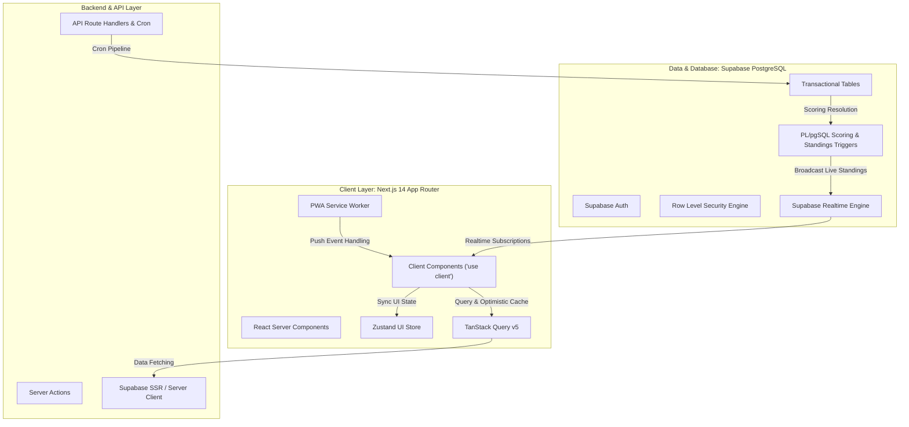
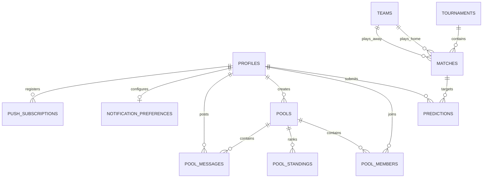

# 🏛️ Architecture & Security Guide

This document describes the architectural blueprints, technology choices, data flows, and security model of **KudoMatch** (PredictorPro).

---

## 🏗️ Technology Stack

- **Framework**: Next.js 14+ (App Router). React Server Components by default; `"use client"` for interactive prediction drawers, live chat, and modals.
- **Styling**: Tailwind CSS + Shadcn UI primitive components with custom glassmorphism layers (`glass-card`, `glass-nav`, `glass-drawer`).
- **State Management**:
  - `Zustand` ([`store/use-ui-store.ts`](store/use-ui-store.ts:1)): Lightweight synchronous global UI states (drawer states, modal toggles, current active match selection).
  - `TanStack Query` (React Query): Server-state management, optimistic cache mutations, background stale-while-revalidate polling.
- **Authentication**: Cookie-based server and browser clients managed via `@supabase/ssr` ([`lib/supabase/`](lib/supabase/)).
- **Database & Storage**: Supabase PostgreSQL with automated database triggers and Row-Level Security (RLS) policies.

---

## 🗃️ Relational Entity Model

### Key Tables & Entities

1. **`profiles`**: User profile attributes (`username`, `full_name`, `avatar_url`, `total_points`).
2. **`matches`**: Fixtures (`home_team_id`, `away_team_id`, `kickoff_time`, `status`, `home_score`, `away_score`, `matchday`).
3. **`predictions`**: Scoreline picks submitted by users (`predicted_home_score`, `predicted_away_score`, `points_earned`).
4. **`pools` & `pool_members`**: Private leagues created by users with 6-character random alphanumeric invite codes.
5. **`pool_standings`**: Pre-calculated pool-specific leaderboard entries for fast queries.
6. **`pool_messages`**: Real-time banter messages sent within a pool.
7. **`notification_preferences` & `push_subscriptions`**: Granular notification channel and event subscriptions.

---

## 🛡️ Row Level Security (RLS) & Security Best Practices

Every public table in KudoMatch enforces PostgreSQL Row Level Security (RLS) with defense-in-depth principles:

### 1. Match Lock Constraint

- **Frontend Prevention**: The prediction drawer disables input and displays lock banners once `new Date() >= new Date(match.kickoff_time)`.
- **Database Constraint**: Migration [`supabase/migrations/20260820000002_create_predictions_table.sql`](supabase/migrations/20260820000002_create_predictions_table.sql) implements an insert/update database trigger that rejects any prediction write if `kickoff_time <= NOW()`.

### 2. User Isolation & Ownership

- Predictions can only be inserted, updated, or viewed by their owner before the match is locked.
- Pool chat messages can only be posted by verified members of that pool.
- Push subscriptions and notification preferences are strictly bound to `(select auth.uid()) = user_id`.

### 3. API Key & Cron Authentication

- Client bundles only contain `NEXT_PUBLIC_` variables. The high-privilege `SUPABASE_SERVICE_ROLE_KEY` is never leaked to the browser.
- Background cron endpoints ([`/api/cron/`](app/api/cron/)) require authorization headers or query tokens matching the server's `CRON_SECRET`.
