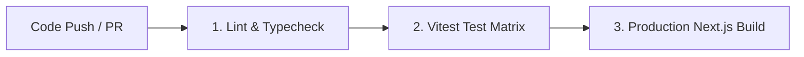

# 🧪 How-To: Testing & CI Pipelines

This guide covers our automated testing philosophy, Vitest suites, test coverage, and GitHub Actions continuous integration pipeline.

---

## 🔬 Test Suites Structure

Our test suite is organized into distinct categories inside [`tests/`](tests/):

| Directory                                | Scope & Targets                                                 | Example Tests                                                                        |
| ---------------------------------------- | --------------------------------------------------------------- | ------------------------------------------------------------------------------------ |
| [`tests/unit/lib/`](tests/unit/lib/)     | Database queries, utility functions, email/push dispatchers     | `notifications.test.ts`, `queries.test.ts`, `supabase.test.ts`                       |
| [`tests/unit/store/`](tests/unit/store/) | Synchronous Zustand state store                                 | `use-ui-store.test.ts`                                                               |
| [`tests/components/`](tests/components/) | React UI components, forms, drawers, modals, and tabs           | `drawers-modals-auth.test.tsx`, `chat-and-h2h.test.tsx`, `notifications-ui.test.tsx` |
| [`tests/app/`](tests/app/)               | App Router page views and API cron route handlers               | `pages.test.tsx`, `route-handlers.test.ts`, `notifications-cron.test.ts`             |
| [`tests/scripts/`](tests/scripts/)       | Data seeders, live score synchronization, and DB backup scripts | `scripts.test.ts`                                                                    |

---

## 🏃 Running Tests Locally

```bash
# Run all unit and integration tests
npm test

# Run tests in watch mode during active development
npm run test:watch

# Run tests with code coverage report
npm run test:coverage
```

---

## 🔍 Type Checking & Linting

Before pushing code or creating a release, ensure all files compile cleanly:

```bash
# Type check with TypeScript compiler
npm run typecheck

# Check for code linting errors
npm run lint

# Build production bundle
npm run build
```

---

## 🚀 Continuous Integration (GitHub Actions)

Our GitHub Actions pipeline ([`.github/workflows/ci.yml`](.github/workflows/ci.yml)) automatically runs on all pushes and pull requests to `main`:



1. **Job 1**: Executes `npm run lint` and `npm run typecheck`.
2. **Job 2**: Executes `npm test` with HappyDOM test environment.
3. **Job 3**: Validates Next.js production build via `npm run build`.
