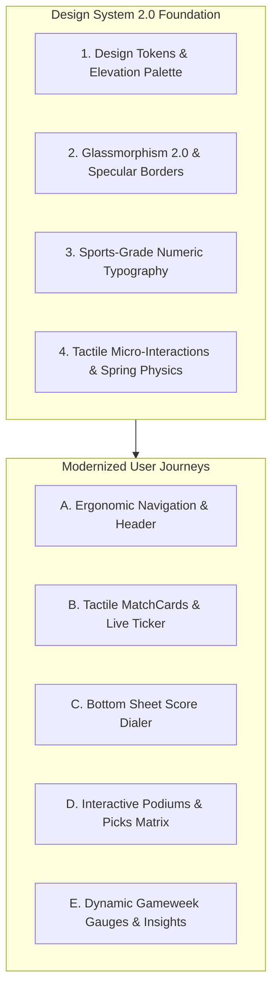
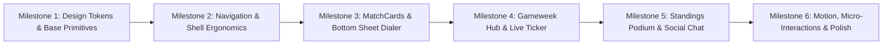

# 🎨 Phase 10: Comprehensive Visual & UX Modernization Roadmap

This document outlines the in-depth visual and user-experience (UX) audit of the **KudoMatch** sports predictor platform, followed by a step-by-step design modernization specification. The goal is to elevate KudoMatch from a functional prototype into an elite, tactile, mobile-first sports gaming platform inspired by premier sports apps (_FotMob_, _Sleeper_, _Premier League App_, _The Athletic_) and modern dark-mode fintech/gaming interfaces (_Linear_, _Raycast_, _DraftKings_).

---

## 🧭 Executive Summary & Design System 2.0 Vision

KudoMatch already features a solid architectural foundation with Next.js 14 App Router, Tailwind CSS, TanStack Query, Framer Motion, and Supabase Realtime. However, the current visual layer exhibits common early-stage design friction points:

1. **Layer Hierarchy & Ambient Lighting**: Flat dark colors (`#030712`, `slate-950`) without a structured surface elevation system (Surface 0 -> Surface 3) and subtle specular highlights.
2. **Glassmorphism Fidelity**: Basic `rgba(15, 23, 42, 0.45)` with standard borders, lacking modern inner shadows, gradient borders, and ambient light rims.
3. **Mobile Thumb Ergonomics**: Right-hand slide drawers on mobile rather than natural bottom sheets; native `<select>` dropdowns for matchdays rather than fluid horizontal pill carousels; dual navigation redundancy between the mobile navbar hamburger and bottom navigation.
4. **Micro-Interactions & Tactility**: Static score buttons and pills with minimal tactile spring feedback, lacking tactile score wheels/dials, smooth counter transitions, and subtle sound/vibration cues.
5. **Data Density & Readability**: Tables requiring horizontal scrolling on mobile viewports instead of responsive, card-transformed data visualizations with sticky anchor columns.

---

## 🔍 Comprehensive Audit Findings by Dimension

### 1. Color System, Surface Hierarchy & Contrast

- **Current State**: Uses default shadcn HSL tokens in [`app/globals.css`](app/globals.css:6) mapped to arbitrary dark blues (`224 71% 4%`), while page files mix hardcoded Tailwind classes like `bg-[#030712]`, `bg-slate-950`, `bg-black/40`, `bg-white/[0.02]`.
- **Friction**: Inconsistent surface contrast across components; borders (`border-white/5` vs `border-white/10`) blend together on OLED mobile screens; lacks dedicated semantic sports accent tokens for live match states (`live-crimson`, `pitch-emerald`, `electric-indigo`, `trophy-amber`, `score-blue`, `neon-teal`).
- **Proposed Solution**:
  - Establish a 4-tier surface elevation token model:
    - **Surface 0 (Canvas)**: `#030712` (Ultra-deep cosmic obsidian)
    - **Surface 1 (Base Cards / Rails)**: `rgba(15, 23, 42, 0.65)` with `1px` subtle top specular highlight
    - **Surface 2 (Elevated Panels / Modals)**: `rgba(30, 41, 59, 0.75)` with blurred backdrop
    - **Surface 3 (Overlays / Dialers)**: `rgba(15, 23, 42, 0.95)` with high blur (`24px`) and luminous accent border
  - Expand [`tailwind.config.ts`](tailwind.config.ts:21) with dedicated sports tokens and luminous glow utilities (`glow-live`, `glow-exact`, `glow-indigo`, `glow-amber`).

---

### 2. Typography, Numbers & Scoreline Readability

- **Current State**: Uses [`Inter`](app/layout.tsx:10) globally for all elements including big matchday scores and countdown timers.
- **Friction**: Standard sans-serif numbers lack tabular font variants (`tabular-nums`), causing jitter during live score transitions and countdown updates. Scorelines on [`MatchCard`](components/match-card.tsx:233) look slightly standard rather than prominent athletic scoreboards.
- **Proposed Solution**:
  - Enable `font-feature-settings: 'tnum' on, 'lnum' on` globally for all numbers and scores.
  - Introduce an athletic font pairing or display weight class (`font-black tracking-tight font-display`) with gradient fill for matchday headers and hero numbers.
  - Implement animated number rollers / odometer effects using `framer-motion` for points tally changes and live rank shifts.

---

### 3. Navigation & Thumb Ergonomics

- **Current State**:
  - Desktop header in [`components/navbar.tsx`](components/navbar.tsx:118) is clean, but on mobile devices includes a hamburger icon opening a full right-side drawer duplicating links already present in [`components/bottom-nav.tsx`](components/bottom-nav.tsx:35).
  - Bottom navigation uses `pb-safe` (not standard in Tailwind without custom utility) and a simple top stripe indicator.
- **Friction**: Mobile users experience navigation confusion with dual menu structures on screen at once.
- **Proposed Solution**:
  - Simplify mobile [`components/navbar.tsx`](components/navbar.tsx:247): Remove redundant hamburger menu on mobile; replace with user profile avatar quick-trigger and active live matchday pill.
  - Modernize [`components/bottom-nav.tsx`](components/bottom-nav.tsx:35) with native-style floating dock or illuminated pill active state with spring-physics tab transitions and iOS safe area padding (`pb-[env(safe-area-inset-bottom,16px)]`).

---

### 4. Predictions Screen & Matchday Experience

- **Current State**:
  - Matchday switcher in [`app/predict/page.tsx`](app/predict/page.tsx:305) is a standard browser `<select>` dropdown.
  - [`components/match-card.tsx`](components/match-card.tsx:140) uses a basic card structure with standard 1 / X / 2 quick-prediction buttons and text badges.
  - [`components/prediction-drawer.tsx`](components/prediction-drawer.tsx:99) slides out from the right (desktop drawer pattern) on mobile, making thumb-based single-handed score adjustments awkward.
- **Friction**: Selecting matches and inputting scores requires multiple hand adjustments and lacks the rapid, high-tactility joy of modern sports predictor apps.
- **Proposed Solution**:
  - **Matchday Rail**: Replace select dropdown with a sleek, horizontal-scrollable Gameweek selector with status badges (`GW 11 Finished`, `GW 12 Live`, `GW 13 Open`).
  - **MatchCard 2.0**:
    - Add team club colored accents / jersey backdrops.
    - Prominent scoreboard container with live state pulsing glow.
    - Quick pick pills (`1` `X` `2`) with tactile micro-press animations, percentage consensus badges, and default score preview.
  - **Mobile Score Bottom Sheet**: Transform prediction drawer into an ergonomic mobile bottom sheet (via Framer Motion spring gesture drag or bottom sheet modal) featuring a circular/stepper score dialer and probability bars.

---

### 5. Leagues, Standings & Picks Matrix

- **Current State**:
  - Top 3 podium in [`app/leagues/[id]/page.tsx`](app/leagues/[id]/page.tsx:447) renders 3 vertical blocks with basic colored avatar borders.
  - Leaderboard and Picks Matrix tables overflow horizontally on mobile screens without sticky player identification columns.
  - Banter Chat in [`components/pool-chat.tsx`](components/pool-chat.tsx:184) is a basic message stream without quick emoji reactions or prediction pick sharing cards.
- **Proposed Solution**:
  - **Pedestal Podium**: Render 1st, 2nd, and 3rd place on an Olympic-style 3D-shaded pedestal with metallic gold/silver/bronze badges, point differentials, and celebratory particle animations.
  - **Sticky Matrix Rail**: Pin the Predictor name column on mobile horizontal scroll so users can easily cross-reference members with distant match columns.
  - **Banter Chat 2.0**: Add 1-tap quick reactions (`🔥`, `💀`, `🎯`, `🤡`, `⚽`), message grouping, and a _"Share Pick into Chat"_ button.

---

### 6. Modals, Score Breakdowns & Feedback

- **Current State**:
  - [`components/score-breakdown-modal.tsx`](components/score-breakdown-modal.tsx:100), [`components/scoring-rules-modal.tsx`](components/scoring-rules-modal.tsx:37), and [`components/match-pool-insights-modal.tsx`](components/match-pool-insights-modal.tsx:82) open centered desktop dialogs with basic scrollbars.
- **Friction**: Centered dialogs on mobile feel detached from the thumb zone.
- **Proposed Solution**:
  - Implement responsive modal containers: centered frosted dialogs on desktop (`sm:max-w-lg md:max-w-xl`), fluid bottom sheets with drag-to-dismiss handles on mobile screens.
  - Add interactive animated scoring flowcharts and distribution bars with smooth gradient fills.

---

## 🛠️ Step-by-Step Modernization Implementation Plan

---

### 🔹 Milestone 1: Design Tokens & Glassmorphism 2.0 Layer System

#### 1.1 Update [`tailwind.config.ts`](tailwind.config.ts:1)

- Extend theme with custom sport palette and glow shadows:
  - `pitch`: `#0f172a`, `pitch-dark`: `#030712`, `pitch-accent`: `#10b981`
  - `live-red`: `#ef4444`, `live-glow`: `rgba(239, 68, 68, 0.4)`
  - `trophy-gold`: `#f59e0b`, `trophy-glow`: `rgba(245, 158, 11, 0.35)`
  - `electric-indigo`: `#6366f1`, `electric-purple`: `#a855f7`
- Add custom utility drop-shadows and backdrop filters.

#### 1.2 Upgrade [`app/globals.css`](app/globals.css:83)

- Replace basic `.glass-card` classes with Glassmorphism 2.0:
  - `glass-card`: Background `rgba(15, 23, 42, 0.65)`, border `1px solid rgba(255, 255, 255, 0.08)`, box-shadow `0 8px 32px 0 rgba(0, 0, 0, 0.37)`, top highlight `inset 0 1px 0 0 rgba(255, 255, 255, 0.1)`.
  - `glass-card-interactive`: Hover state with `border-color: rgba(99, 102, 241, 0.3)` and ambient glow.
  - `glass-sheet`: Background `rgba(10, 15, 30, 0.92)` with `backdrop-filter: blur(24px)`.
  - Custom scrollbar styling for webkit browsers.
  - Safe-area utilities: `.pb-safe { padding-bottom: max(1rem, env(safe-area-inset-bottom)); }`.

---

### 🔹 Milestone 2: Navigation & Shell Ergonomics Overhaul

#### 2.1 Refactor [`components/navbar.tsx`](components/navbar.tsx:20)

- Streamline desktop header:
  - Add active glowing pill for points tally with hover level breakdown.
  - Replace desktop avatar with interactive user badge showing global rank.
- Clean up mobile header:
  - Remove redundant hamburger menu to prevent duplicate navigation on mobile.
  - Display brand logo on left, active Matchweek status in center, points + avatar on right.

#### 2.2 Modernize [`components/bottom-nav.tsx`](components/bottom-nav.tsx:8)

- Enhance mobile bottom navigation:
  - Floating pill bar or edge-to-edge frosted glass bar with `env(safe-area-inset-bottom)`.
  - Illuminated active icons with spring layout animations (`layoutId="active-pill"`).
  - Micro-haptic tap effect (`whileTap={{ scale: 0.88 }}`).

---

### 🔹 Milestone 3: MatchCards 2.0 & Mobile Score Dialer Bottom Sheet

#### 3.1 Redesign [`components/match-card.tsx`](components/match-card.tsx:27)

- **Live Match Pulsing Aura**: When `match.status === 'live'`, render a glowing border with animated broadcast badge.
- **Scoreboard Styling**: High-contrast score numerals with tabular typography and crisp team crest containers.
- **Quick Pick 1 / X / 2 Buttons**:
  - Interactive selection state with micro-press bounce.
  - Tooltip / Subtext indicating implied scoreline (e.g. `1` -> `2-1`, `X` -> `1-1`, `2` -> `1-2`).
- **Points Badge**: Interactive pill opening [`components/score-breakdown-modal.tsx`](components/score-breakdown-modal.tsx:29) with instant feedback.

#### 3.2 Transform [`components/prediction-drawer.tsx`](components/prediction-drawer.tsx:20)

- Convert from desktop side drawer into a responsive **Bottom Sheet & Score Dialer**:
  - Drag handle bar for touch-gesture swipe down to close.
  - Large tactile score steppers with quick-select score pills (`1-0`, `2-0`, `2-1`, `1-1`, `0-0`, `1-2`, `0-2`).
  - Implied outcome indicator with animated point potential projection.

---

### 🔹 Milestone 4: Matchday Hub, Gameweek Rail & Live In-Play Ticker

#### 4.1 Update [`app/predict/page.tsx`](app/predict/page.tsx:31)

- Replace native select dropdown with a **Horizontal Gameweek Rail**:
  - Horizontal scrollable pill list with matchday status indicators (`GW 10`, `GW 11`, `GW 12 (Live)`, `GW 13`).
  - One-tap round switching with smooth scroll-into-view.
- Add **Live Fixtures Ticker Bar**:
  - Sticky or top banner highlighting currently in-play matches with live scores and real-time point swings.

#### 4.2 Upgrade [`components/gameweek-performance-summary.tsx`](components/gameweek-performance-summary.tsx:17)

- Integrate dynamic progress rings / gauge charts for round performance:
  - Gameweek rank momentum indicator (`▲ +3 spots`).
  - Breakdown meters for 3-Pointers, 2-Pointers, 1-Pointers, and Misses with celebratory styling.

---

### 🔹 Milestone 5: Standings Podium, Picks Matrix & Banter Chat

#### 5.1 Redesign [`app/leagues/[id]/page.tsx`](app/leagues/[id]/page.tsx:41) Standings

- **Olympic 3D Podium**: Render 1st, 2nd, 3rd place with metallic pedestals, laurel crowns, and point differentials.
- **Mobile-Responsive Standings**: Card-based view on small screens with rank badges and quick H2H comparison triggers.
- **Picks Matrix Enhancement**: Sticky predictor column on horizontal scrolling, color-coded outcome badges, and match insight modal triggers.

#### 5.2 Polish [`components/pool-chat.tsx`](components/pool-chat.tsx:25)

- Modern chat UI with bubble tail styling, timestamp dividers, quick reaction emojis (`🔥`, `🎯`, `💀`, `⚽`), and celebratory prediction share cards.

#### 5.3 Elevate [`components/head-to-head.tsx`](components/head-to-head.tsx:20)

- Interactive rivalry comparison card with side-by-side win/loss gauges and head-to-head momentum bars.

---

### 🔹 Milestone 6: Motion, Micro-Interactions & UI Primitives

#### 6.1 Upgrade Primitives in [`components/ui/`](components/ui/)

- [`components/ui/button.tsx`](components/ui/button.tsx:7): Add `glow`, `sports-gradient`, and `elevated-glass` variants.
- [`components/ui/tabs.tsx`](components/ui/tabs.tsx:1): Add sliding pill highlight with smooth spring physics.
- [`components/ui/match-card-skeleton.tsx`](components/ui/match-card-skeleton.tsx:1): Implement dual-gradient shimmer animation.

#### 6.2 Modals & Feedback Upgrades

- [`components/score-breakdown-modal.tsx`](components/score-breakdown-modal.tsx:29): Responsive mobile bottom sheet / desktop dialog with interactive rule pipeline cards and confetti celebration for 3-point exact hits.
- [`components/what-if-simulator.tsx`](components/what-if-simulator.tsx:30): Optimized mobile split sheet with quick +/- steppers and instant leaderboard rank shift animations.
- [`components/auth-card.tsx`](components/auth-card.tsx:25) & [`app/profile/page.tsx`](app/profile/page.tsx:32): Elevated achievement badge showcase with metallic rarity tiers.

---

## 🎯 Verification & Acceptance Criteria

When implementing Phase 10:

1. **Design System & Styles**: Zero visual regression across all pages; WCAG AA contrast compliance for all text and badges; responsive safe areas on iOS and Android viewports.
2. **Component Interactions**: Smooth 60fps animations for drawer transitions, tab switching, and score stepping; no layout shifts or mobile horizontal page overflows.
3. **Build & Test Validation**:
   - `npm run build` passes with zero TypeScript errors or compilation warnings.
   - All unit and component tests in [`tests/`](tests/) pass cleanly.
