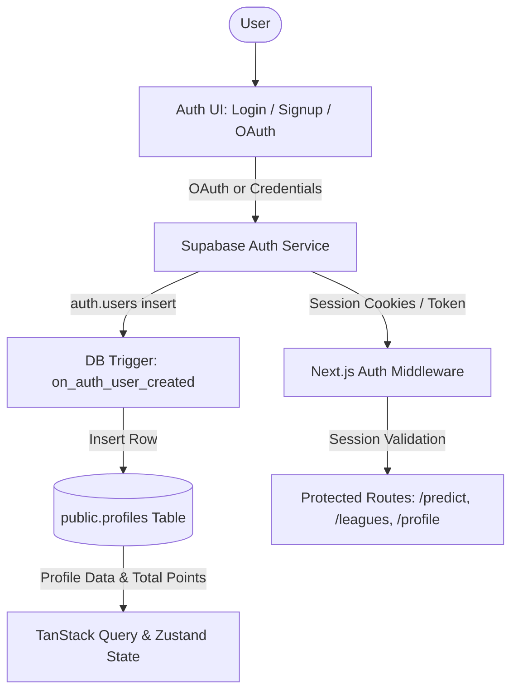

# Phase 1: Initialization & Authentication Architecture Plan

## Overview

Phase 1 establishes the core foundation for **KudoMatch** (PredictorPro): a Next.js 14+ App Router application configured with TypeScript, Tailwind CSS, Shadcn UI, dark mode, Framer Motion, and a robust Supabase Authentication & User Profile system with Row Level Security (RLS).

---

## Architecture & Data Flow

---

## Detailed Implementation Steps

### 1. Project Initialization & Dependencies

- Scaffold Next.js 14+ App Router project in the root repository.
- Install and configure core packages:
  - `@supabase/supabase-js`, `@supabase/ssr`
  - `lucide-react`, `clsx`, `tailwind-merge`, `class-variance-authority`
  - `framer-motion`
  - `zustand`, `@tanstack/react-query`
- Initialize and configure Shadcn UI components (Button, Card, Input, Form, Label, Avatar, DropdownMenu, Toast/Sonner, Dialog).
- Configure dark mode by default (`next-themes` and Tailwind dark mode classes).

### 2. Supabase Integration & Database Schema

- Define environment variable template in [`.env.example`](.env.example) and [`.env.local`](.env.local):
  - `NEXT_PUBLIC_SUPABASE_URL`
  - `NEXT_PUBLIC_SUPABASE_ANON_KEY`
  - `SUPABASE_SERVICE_ROLE_KEY`
- Create migration / SQL script for initial database schema:
  - Table [`public.profiles`](plans/phase_1_initialization_and_auth.md:40):
    - `id` (UUID, primary key, references `auth.users(id)` ON DELETE CASCADE)
    - `username` (TEXT, unique, nullable initially)
    - `full_name` (TEXT)
    - `avatar_url` (TEXT)
    - `total_points` (INTEGER, default 0)
    - `created_at` (TIMESTAMPTZ, default `now()`)
    - `updated_at` (TIMESTAMPTZ, default `now()`)
  - Row Level Security (RLS) policies for `profiles`:
    - Public read access for profiles
    - Authenticated update access for own profile
  - Trigger function [`public.handle_new_user()`](plans/phase_1_initialization_and_auth.md:52) executing on `AFTER INSERT ON auth.users`.

### 3. Supabase Client Utilities & Middleware

- Create browser Supabase client helper [`lib/supabase/client.ts`](lib/supabase/client.ts:1).
- Create server Supabase client helper [`lib/supabase/server.ts`](lib/supabase/server.ts:1).
- Create middleware client & Next.js middleware [`middleware.ts`](middleware.ts:1) for session refreshing and route protection.

### 4. Auth Pages, Components & Callbacks

- Implement Auth callback route [`app/auth/callback/route.ts`](app/auth/callback/route.ts:1) for PKCE code exchange (Google OAuth & Magic link / email confirmations).
- Build reusable Auth UI components:
  - Email/Password Signup form with validation.
  - Email/Password Login form with error handling.
  - Google OAuth sign-in button with clean iconography.
  - Forgot password / reset password flow.
- Build Auth pages:
  - [`app/login/page.tsx`](app/login/page.tsx:1)
  - [`app/signup/page.tsx`](app/signup/page.tsx:1)
  - [`app/reset-password/page.tsx`](app/reset-password/page.tsx:1)

### 5. Root Layout, Navigation & Profile Shell

- Setup root layout with [`ThemeProvider`](components/theme-provider.tsx:1) (dark mode default) and [`QueryProvider`](components/query-provider.tsx:1).
- Build Navbar / Header with logo, navigation links, user avatar dropdown, points badge preview, and sign-out handler.
- Build initial `/profile` page displaying user information, avatar, and total points.
- Build dashboard placeholder `/` ready for Phase 2 & 3.
