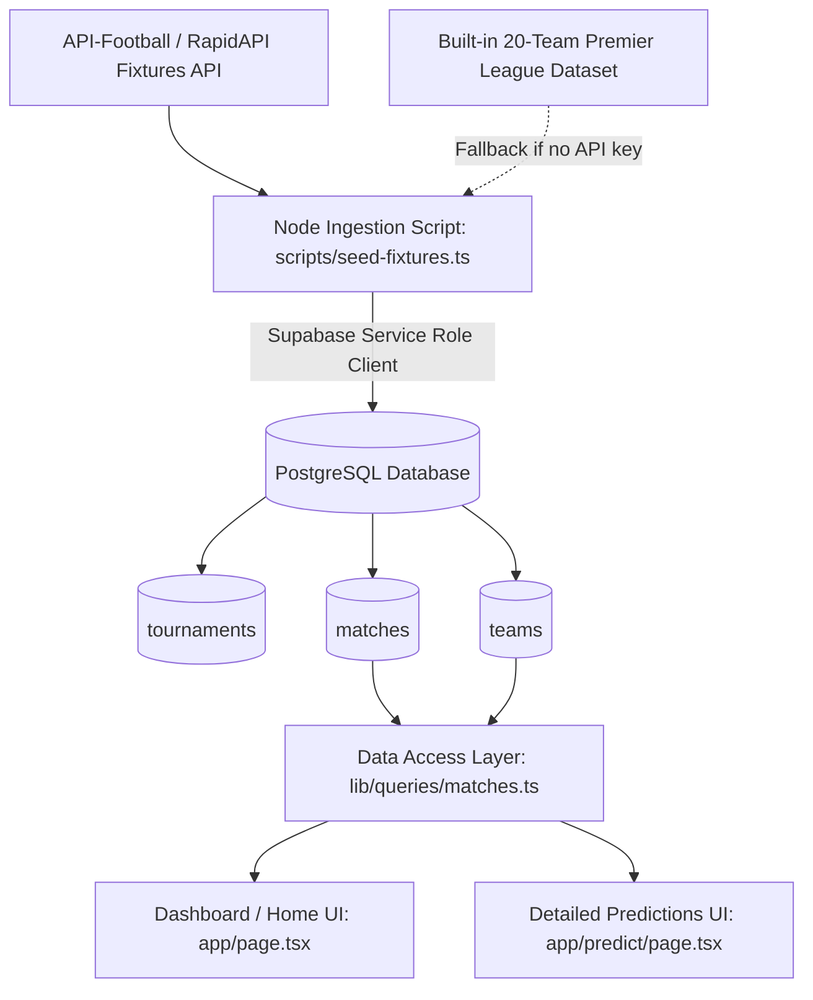

# Phase 2: Data Ingestion (The API) Architecture Plan

## Overview

Phase 2 builds the core data foundation for **KudoMatch** (PredictorPro): provisioning the PostgreSQL database schema for `tournaments`, `teams`, and `matches`, writing a high-reliability data ingestion & seed pipeline connected to API-Football (via RapidAPI) with a comprehensive fallback dataset, and wiring up server/client queries for real-time match retrieval.

---

## Architecture & Ingestion Flow

---

## Detailed Implementation Steps

### 1. Database Schema & Migrations

- Create [`supabase/migrations/20260820000001_create_tournaments_teams_matches.sql`](supabase/migrations/20260820000001_create_tournaments_teams_matches.sql):
  - Table `tournaments`:
    - `id` (UUID PK default `gen_random_uuid()`)
    - `name` (TEXT NOT NULL)
    - `sport` (TEXT NOT NULL DEFAULT 'football')
    - `season` (TEXT)
    - `status` (TEXT DEFAULT 'upcoming')
    - `logo_url` (TEXT)
    - `external_id` (INT UNIQUE)
    - `created_at` (TIMESTAMPTZ DEFAULT now())
  - Table `teams`:
    - `id` (UUID PK default `gen_random_uuid()`)
    - `tournament_id` (UUID REFERENCES tournaments(id) ON DELETE SET NULL)
    - `name` (TEXT NOT NULL)
    - `short_name` (TEXT)
    - `logo_url` (TEXT)
    - `external_id` (INT UNIQUE)
    - `created_at` (TIMESTAMPTZ DEFAULT now())
  - Table `matches`:
    - `id` (UUID PK default `gen_random_uuid()`)
    - `tournament_id` (UUID REFERENCES tournaments(id) ON DELETE CASCADE)
    - `matchday` (INT)
    - `round` (TEXT)
    - `home_team_id` (UUID REFERENCES teams(id) ON DELETE CASCADE)
    - `away_team_id` (UUID REFERENCES teams(id) ON DELETE CASCADE)
    - `kickoff_time` (TIMESTAMPTZ NOT NULL)
    - `home_score` (INT)
    - `away_score` (INT)
    - `status` (TEXT DEFAULT 'scheduled')
    - `external_id` (INT UNIQUE)
    - `created_at` (TIMESTAMPTZ DEFAULT now())
    - `updated_at` (TIMESTAMPTZ DEFAULT now())
  - Enable Row Level Security (RLS) with public read policies on `tournaments`, `teams`, `matches`.

### 2. TypeScript Types Synchronization

- Update [`types/index.ts`](types/index.ts:1) to align `Tournament`, `Team`, and `Match` models with UUID primary keys and optional populated relationships.

### 3. API-Football Integration & Seed CLI

- Install `tsx` and `dotenv` dev dependencies for direct TypeScript script execution.
- Create [`scripts/seed-fixtures.ts`](scripts/seed-fixtures.ts:1):
  - Connects to Supabase using `SUPABASE_SERVICE_ROLE_KEY`.
  - Supports live API fetching via RapidAPI (`x-rapidapi-key` / `x-rapidapi-host: api-football-v1.p.rapidapi.com`).
  - Seamlessly falls back to a complete, realistic Premier League dataset (20 clubs with official logos and upcoming matchday fixtures) when offline or without API keys.
  - Implements idempotent upserts (no duplicate fixtures or teams on multiple runs).
- Add `"seed"` command in [`package.json`](package.json:1) (`npm run seed`).
- Update [`.env.example`](.env.example:1) with `RAPIDAPI_KEY` and `RAPIDAPI_HOST`.

### 4. Data Access Layer & Live Dashboard Integration

- Create [`lib/queries/matches.ts`](lib/queries/matches.ts:1) and [`lib/queries/tournaments.ts`](lib/queries/tournaments.ts:1) with caching and Supabase queries.
- Update [`app/page.tsx`](app/page.tsx:1) to query live matches from Supabase using React Query / RSC.
