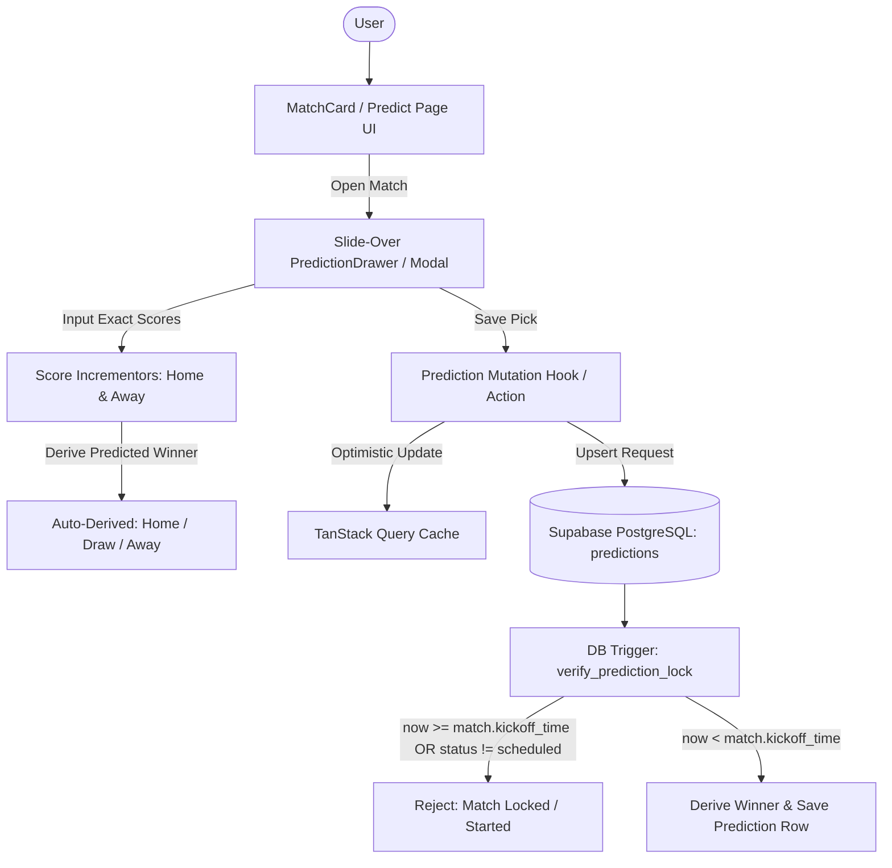

# Phase 3: The Prediction UI Architecture Plan

## Overview

Phase 3 implements the interactive core of **KudoMatch** (PredictorPro): a high-performance, real-time prediction interface enabling users to submit exact scorelines (and quick 1/X/2 picks) for upcoming matches, complete with slide-over prediction drawers, match countdown timers, strict kickoff lock verification on both frontend and database layers, and optimistic state persistence with Supabase.

---

## Architecture & Data Flow



---

## Deep Dive: Database Kickoff Lock Trigger Design

To prevent tampering or late submissions (even if a client bypasses the frontend), the database enforces a server-side PostgreSQL trigger running with `SECURITY DEFINER`:

```sql
CREATE OR REPLACE FUNCTION public.verify_prediction_lock()
RETURNS trigger AS $$
DECLARE
  v_kickoff_time TIMESTAMPTZ;
  v_match_status TEXT;
BEGIN
  -- 1. Fetch kickoff time and status for the target match
  SELECT kickoff_time, status INTO v_kickoff_time, v_match_status
  FROM public.matches
  WHERE id = NEW.match_id;

  IF v_kickoff_time IS NULL THEN
    RAISE EXCEPTION 'Match not found for prediction.';
  END IF;

  -- 2. Verify match status is still scheduled
  IF v_match_status IN ('live', 'finished', 'cancelled') THEN
    RAISE EXCEPTION 'Cannot modify predictions for a match that is live, finished, or cancelled.';
  END IF;

  -- 3. Verify current UTC time against kickoff timestamp
  IF timezone('utc'::text, now()) >= v_kickoff_time THEN
    RAISE EXCEPTION 'Predictions are locked. Kickoff time (%) has already passed.', v_kickoff_time;
  END IF;

  -- 4. Auto-derive predicted_winner to ensure 100% data integrity
  IF NEW.predicted_home_score > NEW.predicted_away_score THEN
    NEW.predicted_winner := 'home';
  ELSIF NEW.predicted_home_score < NEW.predicted_away_score THEN
    NEW.predicted_winner := 'away';
  ELSE
    NEW.predicted_winner := 'draw';
  END IF;

  NEW.updated_at := timezone('utc'::text, now());
  RETURN NEW;
END;
$$ LANGUAGE plpgsql SECURITY DEFINER;

CREATE TRIGGER before_prediction_save
  BEFORE INSERT OR UPDATE ON public.predictions
  FOR EACH ROW EXECUTE PROCEDURE public.verify_prediction_lock();
```

---

## Detailed Implementation Steps

### 1. Database Schema Migration: `predictions` Table & Lock Trigger

- File: [`supabase/migrations/20260820000002_create_predictions_table.sql`](supabase/migrations/20260820000002_create_predictions_table.sql)
- Schema:
  - Table `predictions`:
    - `id` (UUID PK default `gen_random_uuid()`)
    - `user_id` (UUID REFERENCES `public.profiles(id)` ON DELETE CASCADE NOT NULL)
    - `match_id` (UUID REFERENCES `public.matches(id)` ON DELETE CASCADE NOT NULL)
    - `predicted_home_score` (INT NOT NULL CHECK (`predicted_home_score >= 0`))
    - `predicted_away_score` (INT NOT NULL CHECK (`predicted_away_score >= 0`))
    - `predicted_winner` (TEXT CHECK (`predicted_winner IN ('home', 'away', 'draw')`))
    - `points_earned` (INT DEFAULT 0)
    - `created_at` (TIMESTAMPTZ DEFAULT timezone('utc'::text, now()) NOT NULL)
    - `updated_at` (TIMESTAMPTZ DEFAULT timezone('utc'::text, now()) NOT NULL)
    - `UNIQUE(user_id, match_id)`
- Indexes:
  - Foreign key index on `user_id`: `idx_predictions_user_id`
  - Foreign key index on `match_id`: `idx_predictions_match_id`
  - Combined index: `idx_predictions_user_match` (`user_id`, `match_id`)
- Database Lock Trigger:
  - Function `public.verify_prediction_lock()`: blocks INSERT/UPDATE if `now() >= matches.kickoff_time` or match is live/finished.
- Row Level Security (RLS):
  - `SELECT`: Users can view their own predictions anytime. After match kickoff (`now() >= kickoff_time`), predictions are viewable by all authenticated users.
  - `INSERT` / `UPDATE` / `DELETE`: Authenticated user where `auth.uid() = user_id`.

### 2. Client Prediction Store & Data Access Layer

- Create [`lib/queries/predictions.ts`](lib/queries/predictions.ts:1):
  - `getUserPredictions(userId: string, matchday?: number)`
  - `savePrediction(prediction: { matchId: string; homeScore: number; awayScore: number })`
- TanStack Query hooks (`usePredictions`, `useSavePrediction`) with optimistic updates and cache invalidation.

### 3. Prediction UI Components

- Build [`components/match-card.tsx`](components/match-card.tsx:1):
  - Team logos, names, short names, and kickoff countdown timer.
  - Interactive "1 / X / 2" quick toggle pill bar.
  - Exact scoreline pill displaying user's current pick (e.g., `2 - 1`).
  - Lock indicator when kickoff time has passed (dimmed card, lock badge, disabled inputs).
- Build [`components/prediction-drawer.tsx`](components/prediction-drawer.tsx:1):
  - Slide-over glassmorphic drawer using Framer Motion & Radix Dialog.
  - Large numerical score adjusters (+ / - buttons and direct numeric inputs).
  - Outcome breakdown (e.g., "Chelsea Win by 1 goal").
  - Instant Save button with visual feedback and toast notifications.

### 4. Page Implementation: `/predict` & Dashboard Integration

- Build [`app/predict/page.tsx`](app/predict/page.tsx:1):
  - Matchday selector (e.g., Matchweek 12).
  - Matchday countdown timer (counting down to the earliest kickoff in that round).
  - Complete list of `MatchCard` components with live drawer binding.
  - Filter tabs: All Matches, Predicted, Unpredicted.
- Update [`app/page.tsx`](app/page.tsx:1) to use the new `MatchCard` and sync quick picks with the `predictions` table when logged in.
