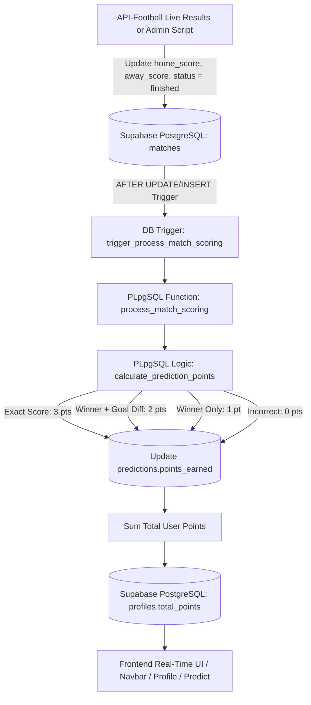

# Phase 4: Scoring Engine Architecture Plan

## Overview

Phase 4 implements the central business logic and calculations of **KudoMatch** (PredictorPro): the **Scoring Engine**. The engine evaluates submitted predictions against official final scorelines, awards tiered points according to standard sports prediction rules, updates user totals on public profiles atomically, provides full idempotency for retroactive score corrections, and showcases match outcomes and point tallies on the frontend with rich badges and statistics.

---

## Architecture & Scoring Flow



---

## Scoring Rules & Logic Hierarchy

The scoring algorithm calculates points deterministically based on the user's prediction and the official final match score:

| Scenario                        | Pred Score | Actual Score | Outcome Match     | Goal Diff Match | Points Awarded |
| :------------------------------ | :--------- | :----------- | :---------------- | :-------------- | :------------- |
| **Exact Scoreline**             | `2 - 1`    | `2 - 1`      | Yes               | Yes (Exact)     | **+3 Points**  |
| **Exact Scoreline (Draw)**      | `2 - 2`    | `2 - 2`      | Yes               | Yes (Exact)     | **+3 Points**  |
| **Winner & Goal Difference**    | `2 - 1`    | `3 - 2`      | Yes (Home)        | Yes (+1)        | **+2 Points**  |
| **Draw & Goal Difference**      | `1 - 1`    | `2 - 2`      | Yes (Draw)        | Yes (0)         | **+2 Points**  |
| **Winner Only (Diff Mismatch)** | `3 - 1`    | `1 - 0`      | Yes (Home)        | No (+2 vs +1)   | **+1 Point**   |
| **Incorrect Outcome**           | `2 - 1`    | `1 - 2`      | No (Home vs Away) | No              | **0 Points**   |
| **Incorrect Outcome (Draw)**    | `1 - 1`    | `2 - 1`      | No (Draw vs Home) | No              | **0 Points**   |

---

## Deep Dive: Database Trigger & Functions Design

Adhering to Supabase Postgres best practices, scoring logic is encapsulated in database functions running with `SECURITY DEFINER` and `SET search_path = public, pg_temp;`.

### 1. Pure Calculation Function (`calculate_prediction_points`)

```sql
CREATE OR REPLACE FUNCTION public.calculate_prediction_points(
  p_pred_home integer,
  p_pred_away integer,
  p_actual_home integer,
  p_actual_away integer
)
RETURNS integer AS $$
DECLARE
  v_pred_diff integer;
  v_actual_diff integer;
  v_pred_outcome text;
  v_actual_outcome text;
BEGIN
  IF p_pred_home IS NULL OR p_pred_away IS NULL OR p_actual_home IS NULL OR p_actual_away IS NULL THEN
    RETURN 0;
  END IF;

  -- Exact Score: 3 Points
  IF p_pred_home = p_actual_home AND p_pred_away = p_actual_away THEN
    RETURN 3;
  END IF;

  v_pred_diff := p_pred_home - p_pred_away;
  v_actual_diff := p_actual_home - p_actual_away;

  IF v_pred_diff > 0 THEN v_pred_outcome := 'home';
  ELSIF v_pred_diff < 0 THEN v_pred_outcome := 'away';
  ELSE v_pred_outcome := 'draw';
  END IF;

  IF v_actual_diff > 0 THEN v_actual_outcome := 'home';
  ELSIF v_actual_diff < 0 THEN v_actual_outcome := 'away';
  ELSE v_actual_outcome := 'draw';
  END IF;

  -- If outcome differs, 0 points
  IF v_pred_outcome != v_actual_outcome THEN
    RETURN 0;
  END IF;

  -- Winner & Goal Difference matches: 2 Points
  IF v_pred_diff = v_actual_diff THEN
    RETURN 2;
  END IF;

  -- Winner only: 1 Point
  RETURN 1;
END;
$$ LANGUAGE plpgsql IMMUTABLE;
```

### 2. Match Scoring Trigger Function (`process_match_scoring`)

When a match is set to `status = 'finished'` with valid scores:

- Updates `points_earned` on [`public.predictions`](supabase/migrations/20260820000002_create_predictions_table.sql:2) for all predictions associated with this match.
- Atomically updates `total_points` on [`public.profiles`](supabase/migrations/20260820000000_create_profiles.sql:2) by calculating the sum of `points_earned` across all predictions for each affected user.
- If a finished match is moved out of `finished` status (e.g. postponed/corrected), points are cleanly reset to 0 and profiles recalculated.

```sql
CREATE OR REPLACE FUNCTION public.process_match_scoring()
RETURNS trigger AS $$
DECLARE
  v_user_ids uuid[];
BEGIN
  -- Collect affected user IDs
  SELECT array_agg(user_id) INTO v_user_ids
  FROM public.predictions
  WHERE match_id = NEW.id;

  IF v_user_ids IS NULL OR array_length(v_user_ids, 1) IS NULL THEN
    RETURN NEW;
  END IF;

  IF NEW.status = 'finished' AND NEW.home_score IS NOT NULL AND NEW.away_score IS NOT NULL THEN
    -- Calculate and assign prediction points
    UPDATE public.predictions
    SET
      points_earned = public.calculate_prediction_points(
        predicted_home_score,
        predicted_away_score,
        NEW.home_score,
        NEW.away_score
      ),
      updated_at = timezone('utc'::text, now())
    WHERE match_id = NEW.id;
  ELSE
    -- Reset points to 0 if status is not finished
    UPDATE public.predictions
    SET
      points_earned = 0,
      updated_at = timezone('utc'::text, now())
    WHERE match_id = NEW.id;
  END IF;

  -- Synchronize total_points on profiles for all affected users
  UPDATE public.profiles p
  SET
    total_points = COALESCE((
      SELECT SUM(points_earned)
      FROM public.predictions
      WHERE user_id = p.id
    ), 0),
    updated_at = timezone('utc'::text, now())
  WHERE p.id = ANY(v_user_ids);

  RETURN NEW;
END;
$$ LANGUAGE plpgsql SECURITY DEFINER SET search_path = public, pg_temp;

CREATE TRIGGER trigger_process_match_scoring
  AFTER INSERT OR UPDATE OF status, home_score, away_score ON public.matches
  FOR EACH ROW
  WHEN (OLD.status IS DISTINCT FROM NEW.status OR OLD.home_score IS DISTINCT FROM NEW.home_score OR OLD.away_score IS DISTINCT FROM NEW.away_score)
  EXECUTE FUNCTION public.process_match_scoring();
```

---

## Detailed Implementation Steps

### 1. Database Schema Migration: Scoring Engine & Total Points Calculation

- Create [`supabase/migrations/20260820000003_scoring_engine.sql`](supabase/migrations/20260820000003_scoring_engine.sql):
  - Add function [`public.calculate_prediction_points()`](supabase/migrations/20260820000003_scoring_engine.sql:1)
  - Add trigger function [`public.process_match_scoring()`](supabase/migrations/20260820000003_scoring_engine.sql:25) and trigger on [`public.matches`](supabase/migrations/20260820000001_create_tournaments_teams_matches.sql:55)
  - Add administrative stored procedure [`public.recalculate_all_scores()`](supabase/migrations/20260820000003_scoring_engine.sql:60) to allow full database-wide score resynchronization at any time.

### 2. Simulation & Score Resolution CLI Utility

- Create [`scripts/score-match.ts`](scripts/score-match.ts):
  - CLI script supporting:
    - **Simulate Matchweek**: Sets realistic final scores on scheduled matches for a given matchday and marks them finished to trigger automated scoring.
    - **Single Match Resolution**: Updates a specific fixture by external or internal ID with final home/away scoreline.
    - **Sync Live Scores**: Optionally queries API-Football via RapidAPI for finished fixtures and applies results.
  - Add script runners in [`package.json`](package.json:1):
    - `"score:simulate": "tsx scripts/score-match.ts --simulate --matchday=12"`
    - `"score:recalculate": "tsx scripts/score-match.ts --recalc"`

### 3. UI Component Updates for Scored Predictions

- Update [`components/match-card.tsx`](components/match-card.tsx:1):
  - Display actual final scores when `status = 'finished'`.
  - Display scored prediction pill with clear visual indicators:
    - **Exact Score**: `+3 pts` with emerald badge and highlight ring.
    - **Winner & GD**: `+2 pts` with teal/cyan badge.
    - **Winner Only**: `+1 pt` with blue badge.
    - **Incorrect**: `0 pts` with subtle muted badge.
  - Display outcome breakdown on finished cards (e.g. "Final: 2 - 1 • Your pick: 2 - 1 • Exact Score!").
- Update [`app/predict/page.tsx`](app/predict/page.tsx:1):
  - Add a **Matchweek Performance Summary** header when finished matches exist (displaying user's matchday points tally, exact hits count, and outcome accuracy percentage).
  - Add filter tab for **Finished** matches.
- Update [`app/profile/page.tsx`](app/profile/page.tsx:1):
  - Replace placeholder recent activity with live query of user's recent finished predictions with scoreline comparison and awarded points.
  - Dynamic badge calculations (e.g. calculate true count of exact scores and active win streak).

### 4. Data Layer & Type Synchronization

- Update [`lib/queries/predictions.ts`](lib/queries/predictions.ts:1):
  - Add `fetchUserScoredPredictions(userId: string)` to fetch scored predictions populated with match and team details.
- Update [`types/index.ts`](types/index.ts:1):
  - Include enriched prediction types with match relationships.

---

## Verification & Testing Plan

1. **Unit / SQL Calculation Testing**:
   - Verify `calculate_prediction_points(2, 1, 2, 1) = 3` (Exact Score)
   - Verify `calculate_prediction_points(1, 1, 1, 1) = 3` (Exact Draw)
   - Verify `calculate_prediction_points(2, 1, 3, 2) = 2` (Home Win & +1 GD)
   - Verify `calculate_prediction_points(1, 1, 2, 2) = 2` (Draw & 0 GD)
   - Verify `calculate_prediction_points(3, 1, 1, 0) = 1` (Home Win, different GD)
   - Verify `calculate_prediction_points(1, 2, 2, 1) = 0` (Wrong outcome)
2. **Trigger Automation Test**:
   - Seed sample predictions for multiple users.
   - Run `npm run score:simulate` to resolve matchday 12 fixtures.
   - Verify `predictions.points_earned` updates immediately.
   - Verify `profiles.total_points` increments correctly to match the sum of earned points.
3. **Frontend Presentation Test**:
   - Inspect `/predict` and `/profile` to ensure badges, scored pills, total points in navbar, and matchday summary stats reflect database values.
4. **Build & Typecheck**:
   - Run `npm run build` to verify clean build without TypeScript or linting errors.
