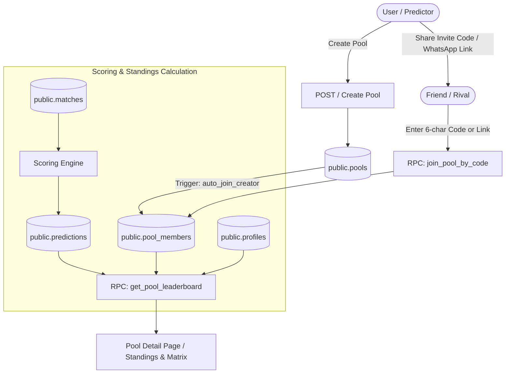

# Phase 5: Leagues, Pools & Standings Architecture Plan

## Overview

Phase 5 introduces the social and competitive backbone of **KudoMatch** (PredictorPro): **Leagues, Private Pools & Standings**. Users can create private or public prediction pools, share 6-character invite codes (and one-tap WhatsApp invite links), join pools seamlessly, and compete on dynamic real-time leaderboards with live ranking, exact score statistics, and member pick comparison matrices.

---

## System Flow & Architecture



---

## 1. Database Schema & RLS Policies

Create migration file [`supabase/migrations/20260820000004_create_pools_and_standings.sql`](supabase/migrations/20260820000004_create_pools_and_standings.sql):

### A. Pools Table (`public.pools`)

Stores private and public prediction leagues.

```sql
CREATE TABLE public.pools (
    id UUID PRIMARY KEY DEFAULT gen_random_uuid(),
    name TEXT NOT NULL CHECK (char_length(trim(name)) >= 3 AND char_length(name) <= 60),
    description TEXT,
    invite_code TEXT UNIQUE NOT NULL,
    creator_id UUID NOT NULL REFERENCES public.profiles(id) ON DELETE CASCADE,
    is_public BOOLEAN NOT NULL DEFAULT FALSE,
    tournament_id UUID REFERENCES public.tournaments(id) ON DELETE SET NULL,
    created_at TIMESTAMPTZ NOT NULL DEFAULT timezone('utc'::text, now()),
    updated_at TIMESTAMPTZ NOT NULL DEFAULT timezone('utc'::text, now())
);

-- Indexing for fast code lookup & creator queries
CREATE INDEX idx_pools_invite_code ON public.pools (invite_code);
CREATE INDEX idx_pools_creator_id ON public.pools (creator_id);
CREATE INDEX idx_pools_is_public ON public.pools (is_public);
```

### B. Pool Members Table (`public.pool_members`)

Many-to-many relationship linking profiles to pools.

```sql
CREATE TABLE public.pool_members (
    pool_id UUID NOT NULL REFERENCES public.pools(id) ON DELETE CASCADE,
    user_id UUID NOT NULL REFERENCES public.profiles(id) ON DELETE CASCADE,
    role TEXT NOT NULL DEFAULT 'member' CHECK (role IN ('creator', 'admin', 'member')),
    joined_at TIMESTAMPTZ NOT NULL DEFAULT timezone('utc'::text, now()),
    PRIMARY KEY (pool_id, user_id)
);

-- Indexing for fast member lookups
CREATE INDEX idx_pool_members_user_id ON public.pool_members (user_id);
CREATE INDEX idx_pool_members_pool_id ON public.pool_members (pool_id);
```

### C. Row Level Security (RLS) Configuration

1. **`public.pools`**:
   - `SELECT`: Authenticated users can view public pools, pools they created, pools they are members of, or pools queried specifically by valid invite code (for preview before joining).
   - `INSERT`: Authenticated users can create pools where `creator_id = (select auth.uid())`.
   - `UPDATE`: Pool creator can update pool settings where `creator_id = (select auth.uid())`.
   - `DELETE`: Pool creator can delete pool where `creator_id = (select auth.uid())`.

2. **`public.pool_members`**:
   - `SELECT`: Authenticated users can view member rows for public pools or any pool they belong to.
   - `INSERT`: Authenticated users can insert their own membership (`user_id = (select auth.uid())`).
   - `DELETE`: Users can leave a pool (`user_id = (select auth.uid())`) or the pool creator can remove members.

---

## 2. Database Functions & Automation Triggers

### A. Unique 6-Character Invite Code Generator

Deterministic alphanumeric code generator (excluding confusing characters like `0/O`, `1/I`):

```sql
CREATE OR REPLACE FUNCTION public.generate_pool_invite_code()
RETURNS text AS $$
DECLARE
  v_chars text := 'ABCDEFGHJKLMNPQRSTUVWXYZ23456789';
  v_result text := '';
  v_i integer;
  v_exists boolean;
BEGIN
  LOOP
    v_result := '';
    FOR v_i IN 1..6 LOOP
      v_result := v_result || substr(v_chars, floor(random() * length(v_chars) + 1)::integer, 1);
    END LOOP;

    -- Check if code is already taken
    SELECT EXISTS (SELECT 1 FROM public.pools WHERE invite_code = v_result) INTO v_exists;
    IF NOT v_exists THEN
      RETURN v_result;
    END IF;
  END LOOP;
END;
$$ LANGUAGE plpgsql VOLATILE;
```

### B. Auto-Join Creator Trigger

Whenever a new pool is inserted, automatically enroll the creator into [`public.pool_members`](supabase/migrations/20260820000004_create_pools_and_standings.sql:20) as `'creator'`:

```sql
CREATE OR REPLACE FUNCTION public.handle_new_pool_creator()
RETURNS trigger AS $$
BEGIN
  INSERT INTO public.pool_members (pool_id, user_id, role, joined_at)
  VALUES (NEW.id, NEW.creator_id, 'creator', timezone('utc'::text, now()))
  ON CONFLICT (pool_id, user_id) DO NOTHING;
  RETURN NEW;
END;
$$ LANGUAGE plpgsql SECURITY DEFINER SET search_path = public, pg_temp;

CREATE TRIGGER trigger_auto_join_pool_creator
  AFTER INSERT ON public.pools
  FOR EACH ROW
  EXECUTE FUNCTION public.handle_new_pool_creator();
```

### C. Secure Join Pool RPC (`join_pool_by_code`)

Atomic database procedure that validates the invite code, handles case-insensitivity, checks whether the user is already a member, and inserts them safely:

```sql
CREATE OR REPLACE FUNCTION public.join_pool_by_code(p_invite_code text)
RETURNS jsonb AS $$
DECLARE
  v_pool_id uuid;
  v_pool_name text;
  v_user_id uuid := auth.uid();
  v_already_member boolean;
BEGIN
  IF v_user_id IS NULL THEN
    RETURN jsonb_build_object('success', false, 'error', 'Unauthorized');
  END IF;

  -- Normalize invite code to uppercase
  p_invite_code := upper(trim(p_invite_code));

  -- Lookup pool
  SELECT id, name INTO v_pool_id, v_pool_name
  FROM public.pools
  WHERE invite_code = p_invite_code;

  IF v_pool_id IS NULL THEN
    RETURN jsonb_build_object('success', false, 'error', 'Invalid or expired invite code.');
  END IF;

  -- Check if already member
  SELECT EXISTS (
    SELECT 1 FROM public.pool_members
    WHERE pool_id = v_pool_id AND user_id = v_user_id
  ) INTO v_already_member;

  IF v_already_member THEN
    RETURN jsonb_build_object('success', true, 'pool_id', v_pool_id, 'name', v_pool_name, 'message', 'Already a member of this pool.');
  END IF;

  -- Insert membership
  INSERT INTO public.pool_members (pool_id, user_id, role, joined_at)
  VALUES (v_pool_id, v_user_id, 'member', timezone('utc'::text, now()));

  RETURN jsonb_build_object('success', true, 'pool_id', v_pool_id, 'name', v_pool_name, 'message', 'Successfully joined pool!');
END;
$$ LANGUAGE plpgsql SECURITY DEFINER SET search_path = public, pg_temp;
```

### D. High-Performance Pool Leaderboard RPC (`get_pool_leaderboard`)

Aggregates prediction points for pool members, computes exact scores hit count (`exact_count`), total predictions made, outcome accuracy percentage, and resolves tiebreakers:

```sql
CREATE OR REPLACE FUNCTION public.get_pool_leaderboard(p_pool_id uuid)
RETURNS TABLE (
  rank bigint,
  user_id uuid,
  username text,
  full_name text,
  avatar_url text,
  total_points bigint,
  exact_count bigint,
  predictions_count bigint,
  joined_at timestamptz
) AS $$
BEGIN
  RETURN QUERY
  WITH member_scores AS (
    SELECT
      pm.user_id,
      prof.username,
      prof.full_name,
      prof.avatar_url,
      pm.joined_at,
      COALESCE(SUM(pred.points_earned), 0)::bigint AS total_points,
      COALESCE(COUNT(CASE WHEN pred.points_earned = 3 THEN 1 END), 0)::bigint AS exact_count,
      COALESCE(COUNT(pred.id), 0)::bigint AS predictions_count
    FROM public.pool_members pm
    JOIN public.profiles prof ON prof.id = pm.user_id
    LEFT JOIN public.predictions pred ON pred.user_id = pm.user_id
    WHERE pm.pool_id = p_pool_id
    GROUP BY pm.user_id, prof.username, prof.full_name, prof.avatar_url, pm.joined_at
  )
  SELECT
    DENSE_RANK() OVER (ORDER BY ms.total_points DESC, ms.exact_count DESC, ms.joined_at ASC)::bigint AS rank,
    ms.user_id,
    ms.username,
    ms.full_name,
    ms.avatar_url,
    ms.total_points,
    ms.exact_count,
    ms.predictions_count,
    ms.joined_at
  FROM member_scores ms
  ORDER BY rank ASC, ms.total_points DESC, ms.exact_count DESC, ms.joined_at ASC;
END;
$$ LANGUAGE plpgsql STABLE SECURITY DEFINER SET search_path = public, pg_temp;
```

---

## 3. Data Access Layer (`lib/queries/pools.ts`)

Encapsulates all Supabase queries and mutations using TanStack Query compatibility:

1. [`fetchUserPools(userId: string)`](lib/queries/pools.ts:1):
   - Queries [`public.pool_members`](supabase/migrations/20260820000004_create_pools_and_standings.sql:20) joined with [`public.pools`](supabase/migrations/20260820000004_create_pools_and_standings.sql:2), member counts, and creator profile.
2. [`fetchPoolDetails(poolId: string)`](lib/queries/pools.ts:1):
   - Returns pool metadata, creator details, member count, and user's membership status.
3. [`fetchPoolLeaderboard(poolId: string)`](lib/queries/pools.ts:1):
   - Calls RPC [`get_pool_leaderboard(poolId)`](supabase/migrations/20260820000004_create_pools_and_standings.sql:70).
4. [`fetchPoolPicksMatrix(poolId: string, matchday?: number)`](lib/queries/pools.ts:1):
   - Fetches locked/finished matches alongside member predictions for head-to-head comparison.
5. [`createPool({ name, description, isPublic })`](lib/queries/pools.ts:1):
   - Generates invite code and inserts new pool into [`public.pools`](supabase/migrations/20260820000004_create_pools_and_standings.sql:2).
6. [`joinPoolByCode(inviteCode: string)`](lib/queries/pools.ts:1):
   - Invokes RPC [`join_pool_by_code`](supabase/migrations/20260820000004_create_pools_and_standings.sql:50).
7. [`leavePool(poolId: string, userId: string)`](lib/queries/pools.ts:1):
   - Deletes row from [`public.pool_members`](supabase/migrations/20260820000004_create_pools_and_standings.sql:20).

---

## 4. UI Pages & Components Design

### A. Pools Dashboard: [`app/leagues/page.tsx`](app/leagues/page.tsx:1)

- **Header Section**: "Prediction Pools & Leagues" with quick action buttons:
  - **Create Pool** button (opens modal).
  - **Join with Code** button (opens modal).
- **Active Pools Grid**:
  - Cards showing Pool Name, Total Members, User's Rank in Pool, Total Points leader, Invite Code badge.
  - "Owner" badge for pools created by the user.
- **Featured Public Pools**:
  - Quick-join public community pools.
- **Empty State**:
  - Illustrated prompt with "Create a Pool for your Friends or Office" CTA.

### B. Pool Detail & Leaderboard: [`app/leagues/[id]/page.tsx`](app/leagues/[id]/page.tsx:1)

- **Hero Header**:
  - Pool Title, creator username, total members count.
  - **Invite Code Card**: 6-character code with 1-click **Copy Code** & **WhatsApp Share** (`https://wa.me/?text=Join%20my%20KudoMatch%20prediction%20pool%20...`).
- **Interactive Tabs**:
  1. **🏆 Standings**:
     - **Podium Showcase**: Visual top 3 predictors with gold/silver/bronze medals.
     - **Leaderboard Table**: Dynamic table with Rank, Predictor Avatar/Username, Points, Exact Scores (3-pt count), Total Picks. Current user is highlighted with active glow.
  2. **🔍 Picks Matrix**:
     - Match-by-match grid showing predictions made by each member for recent/finished matches (hiding picks for matches that haven't kicked off yet to prevent copycat cheating).
  3. **👥 Members**:
     - Member directory with roles (`Creator`, `Member`) and joined dates.

### C. Modals & Dialogs

- [`components/create-pool-modal.tsx`](components/create-pool-modal.tsx:1):
  - Form with Pool Name, Optional Description, Public/Private toggle, auto-generated preview invite code.
- [`components/join-pool-modal.tsx`](components/join-pool-modal.tsx:1):
  - 6-character uppercase PIN input format with auto-submit on completion and instant feedback.
- [`components/share-pool-dialog.tsx`](components/share-pool-dialog.tsx:1):
  - Share link generator, QR code preview, and native Web Share API / WhatsApp integration.

---

## 5. Implementation Steps & Checklist

1. **Migration SQL**:
   - Write and apply [`supabase/migrations/20260820000004_create_pools_and_standings.sql`](supabase/migrations/20260820000004_create_pools_and_standings.sql).
2. **TypeScript Declarations**:
   - Update [`types/index.ts`](types/index.ts:1) with `Pool`, `PoolMember`, `PoolLeaderboardEntry`, `PoolPicksMatrix`.
3. **Data Layer**:
   - Create [`lib/queries/pools.ts`](lib/queries/pools.ts:1).
4. **UI Components**:
   - Create [`components/create-pool-modal.tsx`](components/create-pool-modal.tsx:1), [`components/join-pool-modal.tsx`](components/join-pool-modal.tsx:1), and [`components/pool-leaderboard-table.tsx`](components/pool-leaderboard-table.tsx:1).
5. **Pages**:
   - Create [`app/leagues/page.tsx`](app/leagues/page.tsx:1) and [`app/leagues/[id]/page.tsx`](app/leagues/[id]/page.tsx:1).
6. **Navigation & Global Integration**:
   - Connect navbar links and dashboard widgets to pools.
7. **Verification**:
   - Run type checks, create and join test pools, test leaderboard calculations, and run `npm run build`.
