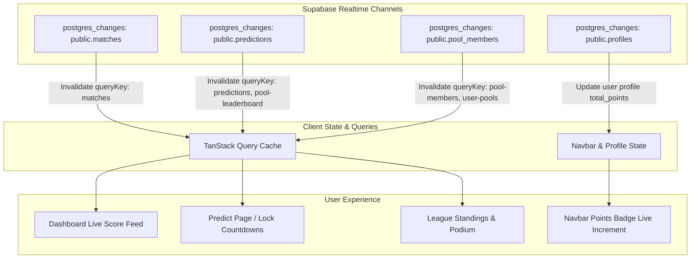

# Phase 6: Polish & Real-Time Experience Architecture Plan

## Overview

Phase 6 elevates **KudoMatch** from a functional sports predictor to a responsive, real-time, mobile-first experience. This phase integrates **Supabase Realtime** for live match score updates, instant leaderboard recalculations, and dynamic points badge incrementing. It also adds **Framer Motion** spring micro-interactions, an interactive **Picks Matrix** for league members to compare locked predictions head-to-head, rich **Sonner Toaster** notifications, and a dedicated **Mobile Bottom Navigation Bar** optimized for one-thumb mobile usage.

---

## Realtime Architecture & Event Flow

---

## 1. Supabase Realtime Channel Implementations

### A. Real-Time Leaderboard & Pool Members (`app/leagues/[id]/page.tsx`)

- Subscribe to `postgres_changes` on `pool_members` filtered by `pool_id=eq.${poolId}` to automatically detect new members joining or leaving.
- Subscribe to `postgres_changes` on `predictions` to automatically refresh the leaderboard whenever predictions are scored or submitted by members.
- Display a pulsating **"LIVE"** real-time status pill indicator on the leaderboard header.

### B. Real-Time User Points & Profile (`components/navbar.tsx` & `app/profile/page.tsx`)

- Subscribe to `postgres_changes` on `profiles` filtered by `id=eq.${user.id}`.
- When background scoring workers update `total_points`, the Navbar trophy badge and Profile stats immediately reflect the new score with a gentle spring animation without requiring a browser refresh.

### C. Real-Time Matches & Live Scores (`app/predict/page.tsx` & `app/page.tsx`)

- Subscribe to `postgres_changes` on `matches`.
- When scores update (`home_score`, `away_score`, `status = 'in_play' | 'finished'`), the match cards instantly update their score badges, lock statuses, and outcome colors.

---

## 2. Head-to-Head Picks Comparison Matrix

In [`app/leagues/[id]/page.tsx`](app/leagues/[id]/page.tsx), add the **"🔍 Picks Matrix"** tab:

- Matrix table showing all pool members along the Y-axis and matches along the X-axis.
- **Fair Play Lock Rule**: Predictions are only revealed for matches that have already kicked off (`kickoff_time <= now()`) or are `finished`. Upcoming unstarted matches display a locked indicator (`🔒 Pick Hidden`) to prevent rival predictors from copying scorelines before kickoff.
- Color-coded badges for exact hits (+3 pts - green), outcome matches (+1-2 pts - teal/blue), and misses (0 pts - slate).

---

## 3. UI/UX Polish & Framer Motion Micro-Interactions

### A. Animations & Micro-Interactions

- **Podium Showcase**: Top 3 ranked users enter with staggered scale/fade spring transitions, glowing crowns for 1st place, and silver/bronze pedestal styling.
- **Score Stepper Controls**: Quick `+` and `-` buttons in the prediction drawer with spring scaling (`whileTap={{ scale: 0.9 }}`) and number slide transitions.
- **Interactive Match Cards**: Hover elevation (`whileHover={{ y: -2 }}`) with subtle neon borders for active matchweeks.
- **Badges Shimmer**: Profile milestone badges with unlock animations and gradient glow highlights.

### B. Global Sonner Toaster (`app/layout.tsx`)

- Mount `<Toaster richColors position="top-right" theme="dark" closeButton />` inside [`app/layout.tsx`](app/layout.tsx) so toast feedback works seamlessly across all pages.

---

## 4. Mobile Ergonomics & Bottom Navigation

### A. Mobile Bottom Navigation Bar (`components/bottom-nav.tsx`)

- Sticky bottom navigation bar for mobile screens (`md:hidden`) with one-thumb accessibility:
  - **Home / Dashboard** (`/`)
  - **Predict** (`/predict`)
  - **Pools** (`/leagues`)
  - **Profile** (`/profile`)
- Active link indicator with glowing dot and smooth icon scaling.

### B. Responsive Spacing & Safe Areas

- Add bottom padding (`pb-20 md:pb-8`) to main container elements to ensure content is not obscured by the mobile bottom navigation bar.
- Share link via Web Share API (`navigator.share`) with fallback to WhatsApp sharing and clipboard copy.

---

## 5. Verification & Build Validation

1. Verify TypeScript types across all realtime subscriptions and matrix structures.
2. Test Realtime listeners with mock database updates.
3. Validate mobile responsiveness across viewport widths (360px, 768px, 1024px, 1440px).
4. Run `npm run build` to confirm zero compilation warnings or type errors.
