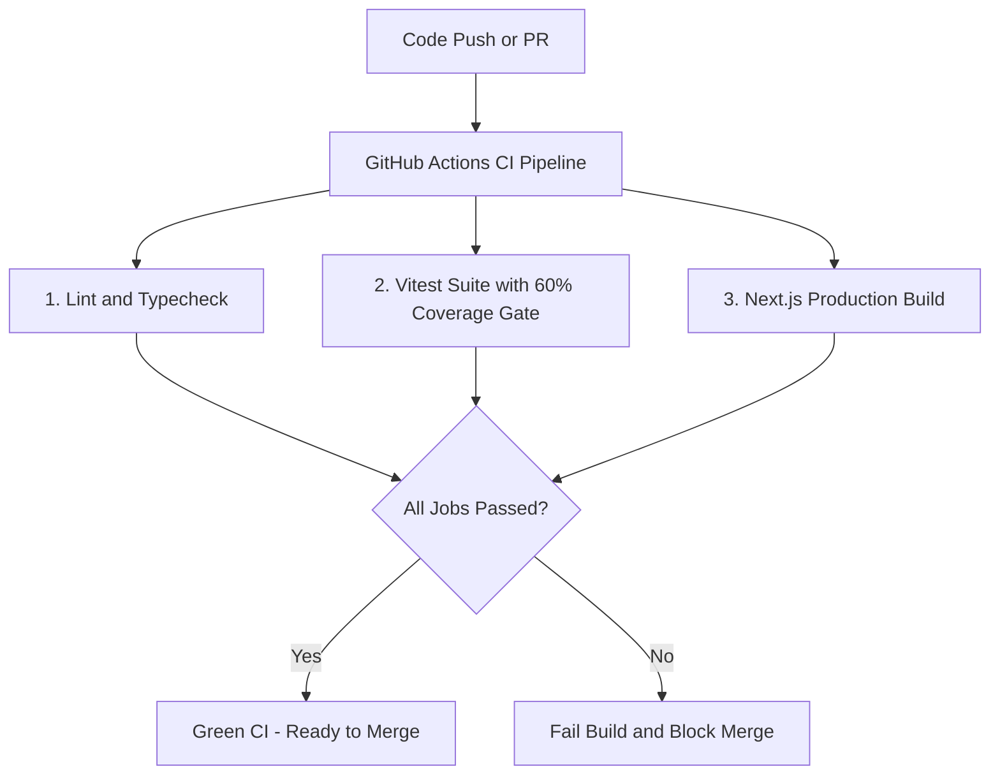

# Phase 7: Robust GitHub CI and Test Coverage Specification (Target >= 60%)

## 1. Overview

This specification outlines the setup and implementation of a modern, lightning-fast testing infrastructure with **Vitest**, **React Testing Library**, **Happy-DOM**, **v8 coverage provider**, and a comprehensive **GitHub Actions CI workflow** to guarantee zero regressions, enforce an initial **60% test coverage baseline** across core application paths, and support incremental expansion upwards.

---

## 2. Architecture & Testing Toolchain

### 2.1 Tooling Selection

- **Test Runner**: [Vitest](https://vitest.dev/) (Native TypeScript/ESM, blazing fast execution, compatibility with Vite/Next.js path aliases).
- **Environment**: [Happy-DOM](https://github.com/capricorn86/happy-dom) / [JSDOM](https://github.com/jsdom/jsdom) for browser-like component DOM testing.
- **Component Testing**: [@testing-library/react](https://testing-library.com/docs/react-testing-library/intro/) + [@testing-library/jest-dom](https://github.com/testing-library/jest-dom) + [@testing-library/user-event](https://testing-library.com/docs/user-event/intro/).
- **Coverage Engine**: `@vitest/coverage-v8` with configurable thresholds in [`vitest.config.mjs`](vitest.config.mjs).
- **CI System**: GitHub Actions workflow defined in [`.github/workflows/ci.yml`](.github/workflows/ci.yml).

### 2.2 Phased Coverage Strategy

To avoid infinite loops and over-mocking while maintaining high software reliability, coverage thresholds are structured iteratively:

1. **Stage 1 (Baseline - 60%)**:
   - `lines: 60%`
   - `statements: 60%`
   - `functions: 60%`
   - `branches: 60%`
   - Focus: High-value unit utilities ([`lib/utils.ts`](lib/utils.ts:1)), store transitions ([`store/use-ui-store.ts`](store/use-ui-store.ts:1)), data queries ([`lib/queries/`](lib/queries/)), core UI components ([`components/`](components/)), and main route pages ([`app/`](app/)).

2. **Stage 2 (Expansion - 75%)**:
   - Branch edge cases in async server actions, Supabase SSR middleware, and modal validation triggers.

3. **Stage 3 (High Assurance - 85%+)**:
   - Script failure handling, edge network states, and fallback avatar/image errors.

### 2.3 Exclusions

- Pure type definition files (`types/index.ts`, `next-env.d.ts`), configuration manifests, script runners with external network deps, and migration SQL files.

---

## 3. Test Suites Structure

```
tests/
├── setup.ts                                # Global mocks (Next Navigation, Supabase, matchMedia, ResizeObserver)
├── unit/
│   ├── lib/
│   │   ├── utils.test.ts                   # cn class merging & format utilities
│   │   ├── supabase.test.ts                # Browser & server Supabase client instantiation
│   │   └── queries.test.ts                 # Match queries, predictions upsert, and pool queries
│   └── store/
│       └── use-ui-store.test.ts            # Zustand UI state transitions and selectors
├── components/
│   ├── ui.test.tsx                         # Button, Card, Input, Label, Tabs, Avatar
│   ├── components.test.tsx                 # MatchCard, Navbar, BottomNav, QueryProvider, ThemeProvider
│   └── drawers-modals-auth.test.tsx        # PredictionDrawer, CreatePoolModal, JoinPoolModal, AuthCard
├── app/
│   ├── pages.test.tsx                      # Main App Router pages (Home, Predict, Leagues, Detail, Auth)
│   └── route-handlers.test.ts              # Auth code exchange callback route handler
└── scripts/
    └── scripts.test.ts                     # CLI script helpers and scoring logic verification
```

---

## 4. GitHub Actions CI Workflow Structure

Workflow defined in [`.github/workflows/ci.yml`](.github/workflows/ci.yml):

1. **Trigger**:
   - Push to `main` branch
   - Pull Requests targeting `main`
2. **Jobs**:
   - `lint-and-typecheck`: Runs [`npm run lint`](package.json:9) and [`npm run typecheck`](package.json:10).
   - `test-and-coverage`: Runs [`npm run test:coverage`](package.json:13) and validates >= 60% coverage gates.
   - `build-verification`: Tests Next.js production build ([`npm run build`](package.json:7)) with sandboxed environment variables.

---

## 5. Execution Workflow Diagram


