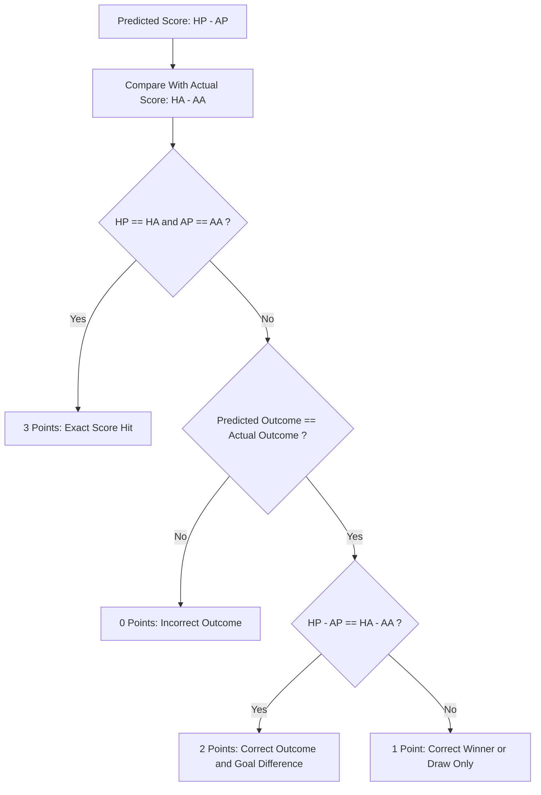

# 📊 Phase 9: Visual Scoring, Live In-Play Tracker & Community Insights

This document outlines the detailed architecture and plan for **Phase 9: Visual Scoring, Live In-Play Tracker, & Outcome Explainer Engine** in **KudoMatch**.

---

## 🎯 Objectives & User Goals

1. **Visual Scoreboards & Match Results**: Provide a rich, real-time visual feed of all match outcomes (Finished, Live In-Play with animated pulse, and Upcoming).
2. **Point Calculation Breakdown & Explainer**: Make scoring 100% transparent with step-by-step interactive breakdowns showing exactly how points are earned (Exact Score 3 pts, Goal Diff 2 pts, Winner 1 pt, Miss 0 pts).
3. **In-Flight Live Points Tracking**: Dynamically calculate and project points in real time for live matches, showing how ongoing games swing the user's score.
4. **"How I & Everyone Scored" Community Insights**: Visual breakdown for each match showing whole-pool distribution (home win %, draw %, away win %, top picked scorelines) and a modal showing every member's pick and points on that match.
5. **Personal Live Performance & Rank Shifts**: Visual indicators showing live rank movement (`▲ +2` / `▼ -1`), points compared to pool average, and gameweek momentum gauges.
6. **"What-If" Scenario Simulator**: Interactive drawer letting users tweak scores to simulate hypothetical leaderboard outcomes and point swings in real time.
7. **Gameweek Form Badges & Micro-Interactions**: Form pills (`🟢 3`, `🔵 1`, `🔴 0`) on leaderboard rows and celebratory confetti animations on exact 3-point predictions.

---

## 🏗️ Architecture & Component Design

### 1. Visual Scoring Rules Engine & Explainer

### 2. Key Components to Build

#### A. `ScoreBreakdownModal` (`components/score-breakdown-modal.tsx`)

- **Trigger**: Clicking on any points badge (e.g. `+3 PTS`, `+2 PTS`, `In-Play: +1 PT`) on [`MatchCard`](components/match-card.tsx:22) or the Picks Matrix.
- **Visual Breakdown Display**:
  - **Match Header**: Team crests, home vs away final/live score, match status.
  - **Your Prediction**: Picked scoreline with outcome badge (Home Win / Draw / Away Win).
  - **Step-by-step Rule Checks**:
    - Step 1: Outcome Accuracy (e.g., _Correct: Home Win_ ✅ / ❌)
    - Step 2: Goal Difference (e.g., _Difference: +1 vs +1_ ✅ / ❌)
    - Step 3: Exact Scoreline (e.g., _Exact: 2-1 vs 2-1_ ✅ / ❌)
  - **Points Awarded Summary**: Vibrant banner displaying final points (`+3 PTS`, `+2 PTS`, `+1 PT`, `0 PTS`).
  - **Scoring Rules Reference Guide**: Accordion/drawer explaining all 4 point tiers with examples.

#### B. `LiveInPlayTracker` & Enhanced `MatchCard`

- **In-Flight Scoring Indicator**: When `match.status === 'live'`, calculate projected points based on the current live score:
  - Example: Match is at 67' (2 - 1). User predicted 3 - 1.
  - Visual Badge: `🟡 Live Tracking: +2 PTS (Outcome & Diff)` with a pulsating live aura.
- **Live Match Strip / Header Carousel**:
  - Compact horizontal ticker showing all active/live fixtures, live scores, and current gameweek in-play point totals.

#### C. `MatchPoolInsightsModal` (`components/match-pool-insights-modal.tsx`)

- **"How Everyone Scored" on This Match**:
  - **Distribution Bar**: % of players who predicted Home Win, Draw, Away Win.
  - **Most Predicted Scoreline**: e.g., _"45% predicted 2 - 1"_.
  - **Participant Breakdown List**:
    - Filterable by points: `All (24)`, `Exact (4)`, `Outcome (14)`, `Missed (6)`.
    - Shows avatar, username, pick, and points earned for this specific game.

#### D. `GameweekPerformanceSummary` (`components/gameweek-performance-summary.tsx`)

- High-fidelity visual dashboard replacing the basic summary:
  - **Gameweek Total Points** with rank delta (`▲ +3 spots this round`).
  - **Points vs Pool Average** visual bar comparison.
  - **Accuracy Gauges**: Circular or progress bar breakdown for Exact hits (3 pts), Goal Diff (2 pts), Winner Only (1 pt), Misses (0 pts).

#### E. `ScoringRulesModal` (`components/scoring-rules-modal.tsx`)

- Universally accessible floating button / help icon on `/predict` and `/leagues/[id]`:
  - Visual interactive cards demonstrating the scoring matrix.
  - Interactive simulator: Users can slide home/away scores to test points calculation.

#### F. `WhatIfScenarioSimulator` (`components/what-if-simulator.tsx`)

- **Interactive Leaderboard Simulation**:
  - Lets users modify live or completed scores with stepper controls (`+` / `-`).
  - Real-time recalculation of all pool member scores and ranks under the simulated scenario.
  - Visual delta banner: _"If Arsenal scores: You jump from 4th (18 pts) to 2nd (21 pts)!"_

#### G. `CelebrationOverlay` & Gameweek Form Badges

- **Confetti Micro-Interactions**: Light canvas-confetti trigger when viewing or scoring exact 3-pointers.
- **Form Pills**: Mini pills displaying the last 5 results (`🟢 3`, `🔵 1`, `🔴 0`) next to user cards and leaderboard rows.

---

## 🗄️ Database & Queries Additions

1. **RPC Function for Match Pick Distribution**:
   - Create `public.get_match_prediction_stats(p_match_id UUID, p_pool_id UUID DEFAULT NULL)` returning:
     - `total_predictions`: count
     - `home_win_count`, `draw_count`, `away_win_count`
     - `exact_score_distribution`: JSON array of `[{ score: "2-1", count: 8 }]`
     - `points_breakdown`: `{ exact_3pts: 4, diff_2pts: 6, winner_1pt: 10, miss_0pts: 4 }`

2. **TypeScript Utility Functions** (`lib/utils/scoring.ts`):
   - Client-side helper `calculatePredictionPoints(predHome, predAway, actualHome, actualAway)` to compute live in-play points dynamically without round-trip latency.
   - Breakdown helper `getScoringExplanation(predHome, predAway, actualHome, actualAway)` returning detailed explanation objects.
   - Simulator helper `simulatePoolStandings(poolMembers, predictions, simulatedMatches)` for instant client-side "What-If" ranking.

---

## 📋 Phased Implementation Breakdown

### 🔹 9.1: Scoring Logic Helper & Visual Explainer Component

- [ ] Create `lib/utils/scoring.ts` with transparent rule calculation and step-by-step reasoning helper.
- [ ] Build `ScoreBreakdownModal` with visual rule verification steps (Outcome ✅, Diff ✅, Exact ✅).
- [ ] Build universal `ScoringRulesModal` with interactive point matrix.

### 🔹 9.2: Live In-Play Scoring & Enhanced Match Cards

- [ ] Update `MatchCard` to support `live` status with live pulsers and in-flight point estimations.
- [ ] Add Gameweek Live Pulse Bar / Matchday carousel on `/predict`.
- [ ] Integrate click-to-explain interactions on all prediction cards.

### 🔹 9.3: "How Everyone Scored" Community Insights

- [ ] Implement database RPC / query `get_match_prediction_stats` to aggregate community picks.
- [ ] Build `MatchPoolInsightsModal` showing pick distributions and who scored what per match.
- [ ] Add trigger buttons on `MatchCard` and `PicksMatrix` to inspect community performance.

### 🔹 9.4: Gameweek Performance, Form Badges & Live Rank Tracking

- [ ] Build `GameweekPerformanceSummary` with live rank deltas and visual accuracy gauges.
- [ ] Enhance `PicksMatrix` with visual score highlights and point filters.
- [ ] Add Form Pills (`🟢 3`, `🔵 1`, `🔴 0`) to leaderboard rows in [`app/leagues/[id]/page.tsx`](app/leagues/[id]/page.tsx:380).

### 🔹 9.5: "What-If" Scenario Simulator & Confetti Celebrations

- [ ] Build `WhatIfScenarioSimulator` component with client-side recalculation.
- [ ] Integrate `canvas-confetti` celebrations for exact 3-point predictions.
- [ ] Connect simulator trigger into pool detail tabs.

### 🔹 9.6: Automated Testing & Build Verification

- [ ] Unit tests for `lib/utils/scoring.ts` covering all edge cases.
- [ ] Component tests for `ScoreBreakdownModal`, `MatchPoolInsightsModal`, `WhatIfScenarioSimulator`, and live match card states.
- [ ] End-to-end build verification (`npm run build`).
