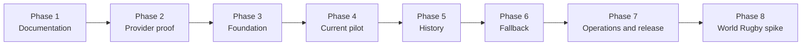

# Rugby Multi-Provider Integration Master Plan

- Status: Phase 1 documentation complete; Phases 2–8 not started.
- Source specification: [Rugby Multi-Provider Data Integration Specification](../../docs/specs/rugby_multi_provider_data_integration_specification.md).
- Architectural prerequisite: [Multi-Sport Architecture Master Specification](../multi_sport_architecture_master.md).
- Delivery rule: exactly one phase is implemented, reviewed, tested, and merged before the next phase starts.

## Purpose

This document is the implementation source of truth for adding resilient, multi-provider Rugby Union data to KudoMatch. It adapts the source specification to the repository's existing generic sports catalog and event model rather than introducing parallel `rugby_*` canonical tables.

External providers are upstream sources. KudoMatch's canonical PostgreSQL data remains the only source used by application reads.

## Phase and PR protocol

For every phase:

1. Start from the latest approved preceding phase.
2. Implement only the current phase document.
3. Update only this status table and the current phase checklist.
4. Run the current phase's tests and required repository verification.
5. Report changed files, migration impact, test evidence, limitations, and rollback instructions.
6. Stop for user review, testing, and a phase-specific PR.
7. Do not begin the next phase until explicitly requested after approval or merge.

If current work changes a future requirement, update that future phase document without implementing it. No phase may include preparatory code, migrations, fixtures, packages, or configuration for its successor.

## Phase documents and status

| Phase | Status | Outcome | Document |
| --- | --- | --- | --- |
| 1 | Complete in working tree; awaiting review | Create the complete documentation set | [Documentation Set](01_documentation_set.md) |
| 2 | Not started | Prove and select the current-data provider | [Provider Proof and Selection](02_provider_proof_and_selection.md) |
| 3 | Not started | Add source ledger, approved mapping, and deterministic reconciliation | [Source Ledger and Reconciliation Foundation](03_source_ledger_and_reconciliation_foundation.md) |
| 4 | Not started | Pilot the approved current provider for Currie Cup and URC | [Primary Current-Provider Pilot](04_primary_current_provider_pilot.md) |
| 5 | Not started | Reconcile API-Sports history with resumable backfills | [API-Sports History and Backfill](05_api_sports_history_and_backfill.md) |
| 6 | Not started | Add ESPN fallback, health, quality, and conflict control | [Fallback, Quality, and Conflicts](06_fallback_quality_and_conflicts.md) |
| 7 | Not started | Add standings, scheduling, diagnostics, and release gates | [Standings, Operations, Admin, and Release](07_standings_operations_admin_and_release.md) |
| 8 | Not started | Decide whether World Rugby is viable | [World Rugby Feasibility Spike](08_world_rugby_feasibility_spike.md) |



## Locked architecture

### Canonical model

- Reuse `competitions`, `competition_editions`, `competitors`, `events`, `event_competitors`, `external_entity_refs`, event markets, market results, and settlement history.
- Do not create parallel Rugby-specific canonical competition, team, season, or match tables.
- Retain `api-sports`; add `sofascore`, `espn`, and reserved `world-rugby` provider slugs only in their owning phases.
- Keep TheSportsDB as an optional schedule/backfill provider. It is never an implicit completed-result authority.
- Application requests query canonical Supabase data and never make provider HTTP requests.

### Provider contract

The shared `SportProviderAdapter` will gain declared capabilities and optional single-event and standings methods. Provider responses enter as `unknown`, pass provider-specific schema validation, and normalize into canonical DTOs plus entity-level source metadata.

Provider modules are server-only. They never create database clients, write rows, or expose credentials/raw payload types to browser code.

### Mapping and reconciliation

- Normal sync never creates a competition or team from a name.
- Unknown provider catalog entities remain `needs_mapping` until an audited management operation maps, creates-and-maps, ignores, or remaps them.
- Resolve a known event by external reference first.
- A new provider event requires mapped competition, edition, home team, and away team.
- Reconciliation candidates must share edition and canonical home/away teams, with kickoff inside an inclusive ±12-hour window.
- Exactly one candidate links automatically. Multiple candidates quarantine. No candidate creates an event only when the provider is configured as fixture authority.
- Once linked, the provider event ID is authoritative; time-window reconciliation is not repeated.

### Results and conflicts

- A completed result from the highest-priority healthy result provider may finalize and settle as `single_source`.
- A lower-priority fallback result remains provisional until the preferred source agrees, a second configured source agrees, or +24-hour verification permits that fallback to finalize alone.
- A score disagreement marks the event `conflicted`, preserves the current canonical result, and prevents automatic correction.
- Manual conflict resolution is audited and uses existing market-result revision and deterministic re-settlement behavior.
- Provider failure, malformed data, or an empty response never clears, fabricates, or regresses canonical data.

## Provider priority matrix

`approved-current` is resolved by the Phase 2 ADR. SofaScore is the first candidate; a replacement requires explicit ADR approval.

| Operation | Priority 1 | Priority 2 | Priority 3 | Notes |
| --- | --- | --- | --- | --- |
| Historical fixtures/results | API-Sports | approved-current | ESPN | API-Sports remains historical authority |
| Current club fixtures | approved-current | ESPN | API-Sports when proven | Applies initially to Currie Cup and URC |
| Current club results | approved-current | ESPN | API-Sports when proven | Fallback finalization follows result-confidence rules |
| Standings | approved-current | ESPN when proven | None | Canonical standings are delivered in Phase 7 |
| Current internationals | approved-current | ESPN | API-Sports | World Rugby cannot enter this order before a later implementation approval |
| International verification | approved-current | ESPN | API-Sports | Phase 8 may recommend World Rugby but does not implement it |

Priority is stored by competition and operation. Provider request order never implies authority.

## P0 requirement ownership

Each required criterion has exactly one verification owner.

| Source P0 criterion | Owning phase | Verification outcome |
| --- | --- | --- |
| Existing API-Sports integration remains functional | 5 | Existing adapter passes recorded and allowed real-provider regressions after source-ledger integration |
| Historical fixtures import from API-Sports | 5 | Resumable historical import completes and reruns idempotently |
| SofaScore adapter is implemented | 4 | Implemented if Phase 2 approves SofaScore; otherwise the criterion may be superseded only by explicit ADR/user approval |
| Current SofaScore fixtures import | 4 | Pilot current fixtures reconcile into canonical events under the same approval condition |
| Completed SofaScore results import | 4 | Pilot completed results are stored and settlement behavior is verified under the same approval condition |
| Provider IDs are separate from canonical IDs | 3 | Source rows and external references enforce separate identities |
| Teams are mapped across providers | 3 | Unknown teams fail closed and reviewed mappings are auditable |
| Competitions are mapped across providers | 3 | Only configured, audited competition mappings can sync canonically |
| Duplicate provider matches resolve to one canonical match | 3 | Direct identity and deterministic ±12-hour reconciliation tests pass |
| Provider raw payloads are retained | 3 | Latest valid entity payload is retained; invalid payload is quarantined |
| Provider schema validation exists | 3 | Fixture-based validation accepts supported shapes and rejects drift |
| Sync reruns do not create duplicates | 3 | Recorded source and canonical upserts are idempotent |
| Completed matches are stored locally | 4 | Pilot completed results remain queryable during provider outage |
| Application reads internal data, not providers | 4 | Pilot application query path works with provider access disabled |
| Provider errors do not take down the application | 3 | Item, request, and batch failures preserve canonical reads and healthy sibling work |

## P1 requirement ownership

| Source P1 criterion | Owning phase | Verification outcome |
| --- | --- | --- |
| ESPN adapter | 6 | Implemented only for coverage proven in Phase 2 or a reviewed follow-up ADR |
| ESPN as secondary source | 6 | Configured secondary priority is exercised in recorded tests |
| Automatic provider fallback | 6 | Capability, priority, health, circuit, and budget select a safe fallback |
| Score conflict detection | 6 | Disagreement creates `conflicted` state without silent overwrite |
| Provider health monitoring | 6 | Success, failure, latency, schema, HTTP, and rate data update runtime state |
| Provider diagnostics/admin view | 7 | Authorized read-only diagnostics show canonical/source comparisons and sync state |
| Standings synchronization | 7 | Canonical standings refresh daily and after completed matches |
| Data-quality state | 6 | `unverified`, `single_source`, `verified`, and `conflicted` transitions are tested |
| Circuit breaker | 6 | Five failures in ten minutes open the circuit; cooldown and half-open recovery work |

## Deferred P2 requirements

The following are explicitly outside Phases 1–8:

- Production World Rugby match-feed adapter; Phase 8 produces only a go/no-go evidence package.
- Player statistics.
- Detailed match statistics.
- Scoring-event timelines.
- Venue metadata beyond the existing canonical display field.
- Rankings ingestion.
- Automatic competition discovery or activation.
- Richer or second-by-second live scoring.
- New provider-driven notifications.

## Global security and database rules

- Use the repository's imperative Supabase migration workflow; create migration files with the installed CLI rather than inventing timestamps.
- New domain IDs use `bigint generated always as identity`; timestamps use `timestamptz`; status/kind values use named checks.
- Every foreign key used for joins, cascades, RLS, or due-work selection has a supporting index. Composite/partial indexes must match demonstrated query shapes.
- Network calls occur outside database transactions. Transactions contain only bounded validation and atomic upserts.
- Every table in an exposed schema has RLS and explicit grants/revokes. Operational/source tables have no client grants.
- Views exposed to clients use `security_invoker = true` on the configured Postgres 17 database.
- Default `PUBLIC` function execution is revoked. Privileged helpers use an empty search path and minimum execute grants.
- Authorization uses fresh `app_metadata`, never user-editable user metadata.
- Provider, cron, and service-role credentials are server-only and never stored in raw payloads or logs.
- Data API grants are explicit because Supabase is removing automatic exposure for new `public` tables: [Supabase changelog](https://supabase.com/changelog/45329-breaking-change-tables-not-exposed-to-data-and-graphql-api-automatically).

## Global verification

Implementation phases run, as applicable:

```bash
npx supabase db reset --local
npx supabase test db --local
npm run typecheck
npm test
npm run build
```

Run Supabase security and performance advisors before enabling pilot writes or exposing new read views. Real-provider probes are never part of deterministic CI; recorded fixtures remain the test authority.

## Definition of success

After Phase 7, KudoMatch can answer current Currie Cup/URC and historical Rugby Union queries from its internal database without the caller knowing the provider. Provider failure does not affect application availability, provider disagreement is visible and controlled, and changing a provider requires an adapter/configuration change rather than a domain-model rewrite.

Phase 8 is separately reviewable and cannot change production provider behavior.
